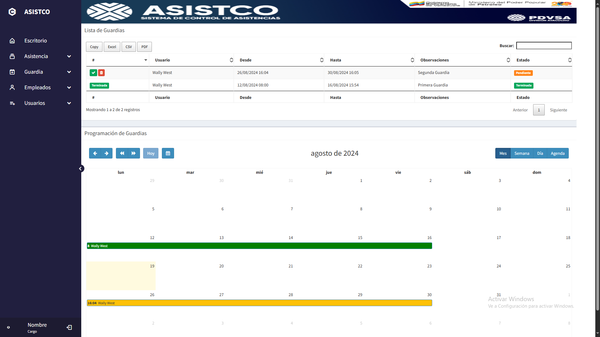
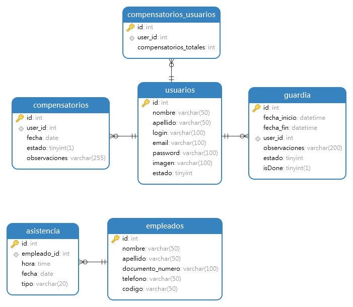

# Asistco
Sistema de control de asistencias, implementación de control de guardia

Vista Previa


## Base de datos actual


Importe el archivo asistco.sql en su base de datos para obtener la nueva base de datos
IMPORTANTE: Esto creara la estructura desde cero eliminando la estructura anterior y su data, asi que respalde la informacion de la base de datos en produccion, importe la estructura y vuelva a montar la data de los respaldos

## Modelos
- Compensatorio.php
- CompensatorioUsuarios.php
- Guardia.php

## Controladores
- Compensatorio.php
- Guardia.php

## Vistas
- Compensatorio.php
- Guardia.php
- newCompensatorioForm.html
- newGuardiaForm.html

## Validaciones Back-End Guardias
- Validar que los valores del formulario no esten vacios
- Validar que la fecha de inicio no puede ser anterior a la fecha de hoy
- Validar que la fecha de finalizacion no sea anterior a la de inicio
- Validar que las fechas sean exactamente 5 dias (Una semana laboral)
- Validar que ni la fecha de inicio ni la fecha fin abarquen fines de semana
- Si el usuario seleccionado ya tiene 4 guardias pendientes no permitir la insercion

## Validaciones Back-End Compensatorios
- Validar que los valores del formulario no esten vacios
- Validar que la fecha de inicio no puede ser anterior a la fecha de hoy
- Validar que la fecha del compensatorio no abarque fines de semana (Si necesita que los compensatorios abarquen fines de semana comente estas validaciones)
- Si el usuario seleccionado tiene 0 compensatorios pendientes no permitir la insercion

## Cambios importantes
Para el correcto funcionamiento de los compensatorios y las guardias, se hicieron ciertos cambios al proyecto base

1. En el controlador de Usuarios.php, se inserta al usuario a la tabla compensatorios_usuarios inmediatamente despues de ser registrado
```php
if (empty($id)) {
$rspta = $usuario->insertar($nombre, $apellido, $login, $email, $clavehash, $imagen);

//AGREGAR AL USUARIO A LOS COMPENSATORIOS UNA VEZ REGISTRADO

//Obtener id de usuario por email
$user_id = $usuario->obtener_userid_byemail($email);
$string = $user_id->fetch_object();

//insertar en los compensatorios
$compensatorioUsuario->insertar($string->id);

echo $rspta ? "Datos registrados correctamente" : "No se pudo registrar todos los datos del usuario";
}
```

2. Los require de los modelos fueron cambiados a require_once
```php
//ANTES
require "../Config/Conexion.php";

//DESPUES
require_once "../Config/Conexion.php";
```
Debido a que en el controlador de Usuarios.php se usan el modelo de Usuarios y de CompensatorioUsuarios se cambio a require_once para evitar que el modelo intente incluir Conexion.php multiples veces

## Librerias y Dependencias
1. FullCalendar 5.11.5
2. SweetAlert2 11.11.0
3. BootStrap >= 3.0
4. FontAwesome >= 4.0
5. JQuery >= 3.1
6. PHP >= 5.6

## Calendario
- Para mas informacion de como funciona el calendario y ver funciones adicionales que le gustaria implementar click en este enlace [Documentacion FullCalendar](https://fullcalendar.io/docs/v5)

Dentro de las etiquetas header de html agregar
```html
<link rel="stylesheet" href="../public/plugins/fullcalendar-5.11.5/lib/main.css">

<script src="../public/plugins/fullcalendar-5.11.5/lib/main.js"></script>
<script src="../public/plugins/fullcalendar-5.11.5/lib/locales-all.js"></script>
```

Dentro de vistas/scripts/calendar4Guardia2.js esta una plantilla limpia de una inicializacion, personalizacion y renderizacion del calendario

Codigo del calendario de las guardias esta en vista/scripts/Guardia.js
Codigo del calendario de los compensatorios esta en vista/scripts/Compensatorio.js

Una vez incluidas las librerias y el codigo de inicializacion, agregar estas etiquetas en el archivo donde desea el calendario
```html
<div id="calendar">

</div>
```
El calendario será renderizado dentro del div con id 'calendar'

## Alertas
- Para mas informacion de como funcionan las alertas y ver funciones adicionales que le gustaria implementar click en este enlace [Documentacion SweetAlert2](https://sweetalert2.github.io/#examples)

Dentro de las etiquetas header agregar 
```html
<link rel="stylesheet" href="../public/plugins/sweetalert2/css/sweetalert2.css">
```

Y en el footer antes de cerrar la etiqueta </body>
```html
    <script src="../public/plugins/sweetalert2/js/sweetalert2.js"></script>
</body>
```

Uso basico:
```html
<body>
    <button id="alertButton">Boton de alerta</button>

    <script>
        document.getElementById('alertButton').addEventListener('click', function () {
            Swal.fire({
                title: 'Hola!',
                text: 'Esta es una alerta basica de Swal2.',
                icon: 'info',
                confirmButtonText: 'Boton de confirmar'
            });
        });
    </script>
</body>
```

## Boton de programar guardias/compensatorios
Usando la opcion customButton de FullCalendar creamos un boton personalizado el cual renderiza un formulario usando SweetAlert2 y ajax

El formulario de guardias esta en vistas/newGuardiaForm.html
El formulario de compensatorios esta en vistas/newCompensatorioForm.html

El boton es el siguiente:
```js
customButtons: {
                addEventBtn: {
                    text: 'Programar Compensatorio',
                    icon: 'bx bx-calendar-plus',
                    click: function () {
                        $.ajax({
                            url: '../controlador/Compensatorio.php?op=getcompensatorioform',
                            type: 'GET',
                            beforeSend: function() {
                                Swal.fire({
                                    heightAuto: false, //Evita que la pagina suba cuando se cierra la alerta
                                    title: 'Cargando...',
                                    text: 'Cargando formulario.',
                                    allowOutsideClick: false,
                                    didOpen: () => {
                                        Swal.showLoading(); // Mostrar gif de cargando
                                    }
                                });
                            },
                            success: function (response) {
                                Swal.fire({
                                    heightAuto: false, //Evita que la pagina suba cuando se cierra la alerta
                                    title: 'Programa un compensatorio',
                                    html: response,
                                    showCancelButton: true,
                                    confirmButtonText: 'Enviar',
                                    confirmButtonColor: '#3C8DBC',
                                    cancelButtonText: 'Cancelar',
                                    cancelButtonColor: '#DC3545',
                                    didOpen: () => { //Hay que reinicializar las dependencias del formulario dentro del sweetalert
                                        $.post('../controlador/Usuario.php?op=select_usuario', function(r) {
                                            $('#user_id').html(r);
                                            $('#user_id').selectpicker('refresh');
                                        });
                                    },
                                }).then((result) => {
                                    if (result.isConfirmed){

                                        let formData = new FormData($('#formulario')[0]);

                                        $.ajax({
                                            url: '../controlador/Compensatorio.php?op=guardaryeditar',
                                            type: 'POST',
                                            data: formData,
                                            contentType: false,
                                            processData: false,
                                            beforeSend: function() {
                                                Swal.fire({
                                                    heightAuto: false, //Evita que la pagina suba cuando se cierra la alerta
                                                    title: 'Enviando...',
                                                    text: 'Enviando formulario.',
                                                    allowOutsideClick: false,
                                                    didOpen: () => {
                                                        Swal.showLoading(); // Mostrar gif de cargando
                                                    }
                                                });
                                            },
                                            success: function (respuesta) {
                                                //Manejar exito
                                                calendar.refetchEvents(); //Refrescar calendario
                                                listar(); //Refrescar datatable1
                                                listar2(); //Refrescar datatable1

                                                Swal.fire({
                                                    heightAuto: false, //Evita que la pagina suba cuando se cierra la alerta
                                                    title: 'Programado Correctamente',
                                                    text: 'Tu compensatorio ha sido programada correctamente',
                                                    icon: 'success',
                                                    showConfirmButton: true,
                                                    confirmButtonText: 'Aceptar',
                                                    confirmButtonColor: '#3C8DBC',
                                                });
                                            },
                                            error: function (error2) {
                                                //Manejar errores
                                                let errorResponse = JSON.parse(error2.responseText);

                                                console.log(errorResponse.errors.join("\n"));

                                                Swal.fire({
                                                    heightAuto: false, //Evita que la pagina suba cuando se cierra la alerta
                                                    title: 'Error en el formulario',
                                                    text: errorResponse.errors.join(", "),
                                                    icon: 'error',
                                                    showConfirmButton: true,
                                                    confirmButtonText: 'Aceptar',
                                                    confirmButtonColor: '#3C8DBC',
                                                });
                                            }
                                        });

                                    }
                                });
                            }
                        })
                    },
                },
            },
```

Integrando el boton a la barra del calendario:

```js
headerToolbar: {
                left: 'prev,next prevYear,nextYear today addEventBtn', //Lo integramos aqui
                center: 'title',
                right: 'dayGridMonth,timeGridWeek,timeGridDay,listWeek'
            },
```